# Git & Github 실무활용
## GIT VS SVN
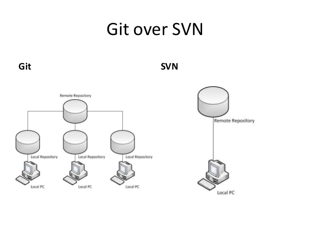
## Git
* 2005 리눅스 커널 개발자인 리누스 토발즈가 개발
* Git은 소프트웨어 개발에서 버전 관리를 위한 도구
* Git은 분산 버전 관리 시스템
* 개별 작업자가 중앙화된 코드 호스팅 시스템에서 독립적으로 일하고 프로젝트 저장소의 개별 로컬 사본에서 작업을 수행
## Git 특징
* Git의 데이터는 파일 시스템의 스냅샷
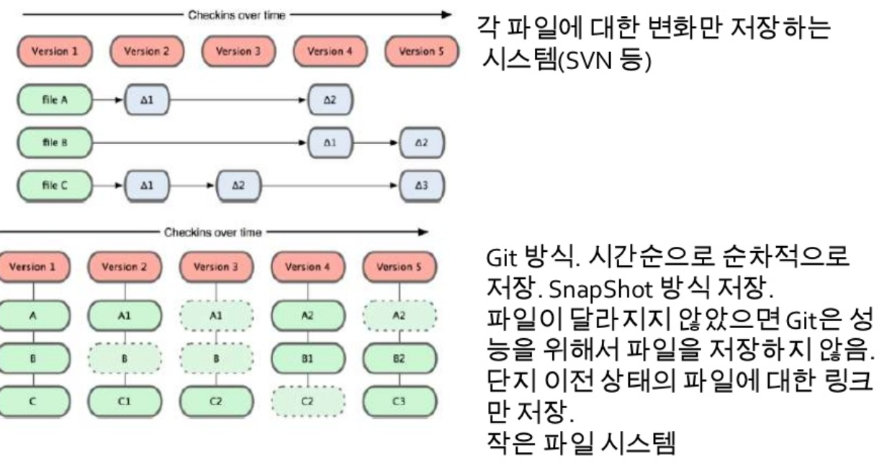
* Git은 시간순으로 파일의 스냅샷을 저장
* Git은 대부분의 명령을 로컬에서 실행
* Git은 오프 라인 상태에서도 작업을 할 수 있음
* Git은 데이터의 무결성을 위해 SHA-1 해시를 사용하여 체크섬을 만듦
* 대규모 프로젝트를 위한 완전한 분산 환경 지원
* 체크섬은 해시(SHA-A)로 40자 길이의 16진수 문자열
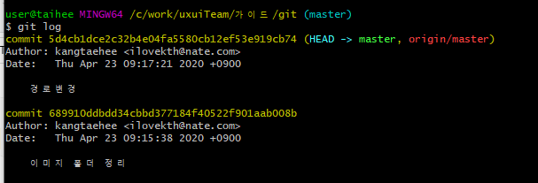
## Git 장점
* 분산 환경에서 저장소 관리

* 로컬 저장소에서 파일 생성 및 수정
* 로컬 저장소에서 수정 내역 추적
* 원격 저장소에 적용된 내용을 동일하게 로컬 저장소에 적용
* 원격에 영향을 끼치지 않는 브랜치 생성
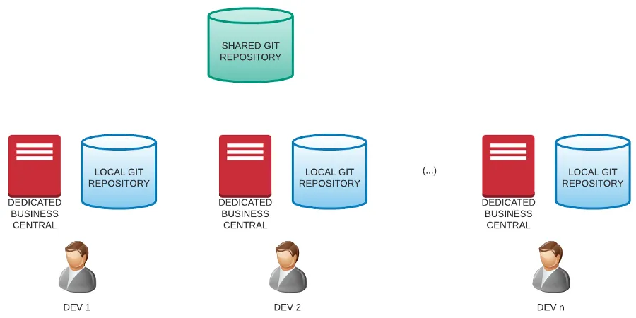
* 버전 관리 용이
* 이슈 추적 용이
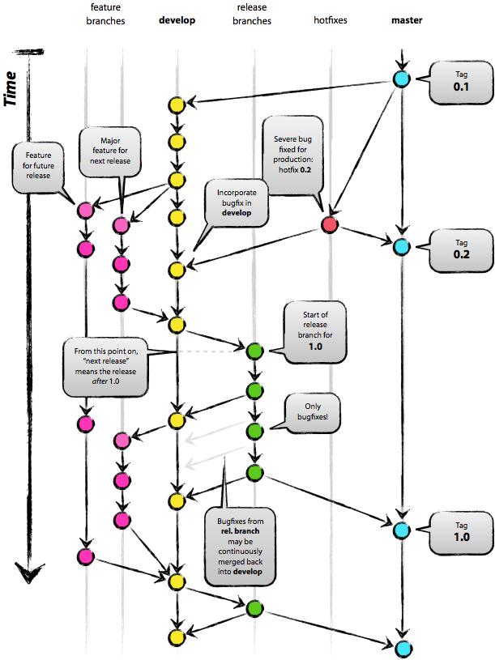
## 저장소(repository)
* 이력을 관리하는 저장소
* 로컬 저장소(Local Repository)
    * 개인 전용 저장소
* 원격 저장소(Remote Repopsitory)
    * 공유 저장소
## 변경 이력 관리(history)
* 커밋 단위
* 40자리 해시키로 관리
* 날짜, 시간, 커밋 메시지, 작업자
* 브랜치 형태로 관리

## 세가지 상태 - modified/stage/commited
* 두 번째로 알아야 할 개념은, modified, stage, committed 이다. 이 세가지 개념은 변경점들이 어떠한 상태에 있는가에 대한 개념이라고 생각하면 된다. 

### committed
* git에서는 변경점의 집합(실제로는 snapshot형태)을 database에 저장하는 행위를 commit이라 한다. committed는, 변경점들이 commit되어 database에 저장된 상태이다.
* 변경이 저장되는 곳, 히스토리로 남는 공간.

### modified
* 말 그대로 변경된 상태이다. git이 기억하고 있던 상태에서 무언가 변경이 일어난 파일은 modified 상태가 된다. 파일의 추가나 삭제도 기존 상태에서 변경이 일어난 것이므로 modified 상태에 포함된다.

### stage
* 변경 사항이 커밋 되기 전에 잠시 머무는 공간
* modified 상태의 내용들 중에 실제 commit의 대상이 될 수 있도록 선택된 상태이다. Tool에 따라서는 파일단위가 아닌 line단위로도 staged상태로 보낼 수 있다. 아무리 사용자가 소스를 수정했어도 staged 상태로 변경되지 않은 내용들은 git에 commit되지 않는다. 대부분의 경우에 번거로운 중간과정이 될 수 있어, staged를 생략하고 modified에서 바로 commit 할 수 있는 옵션도 제공된다.

### 버전에 대한 관점

### 파일에 대한 관점
* 상태 Life Cycle : Untracked <-> Tracked


# 에러발생
* git pull origin 브런치명 --allow-unrelated-histories
* --allow-unrelated-histories 
    * 이 명령 옵션은 이미 존재하는 두 프로젝트의 기록(history)을 저장하는 드문 상황에 사용된다고 한다. 즉, git에서는 서로 관련 기록이 없는 이질적인 두 프로젝트를 병합할 때 기본적으로 거부하는데, 이것을 허용해 주는 것이다.


# git 명령어 기반
```
git [실행명령어] [옵션] [목적지 or 행위] [대상] [추가옵션]
```

# 도움말 보기
`git 명령어 --help`

# git 시작
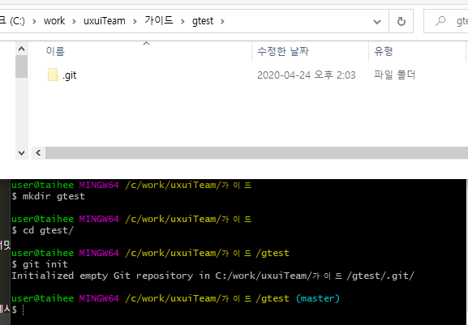
```
초기화
git init

제외파일 설정 http://gitignore.io/
echo -n -e "\n# Created by https://www.gitignore.io/api/java,eclipse,visualstudiocode \n# Edit at https://www.gitignore.io/?templates=java,eclipse,visualstudiocode \n \n### Eclipse ### \n.metadata \nbin/ \ntmp/ \n*.tmp \n*.bak \n*.swp \n*~.nib \nlocal.properties \n.settings/ \n.loadpath \n.recommenders \n \n# External tool builders \n.externalToolBuilders/ \n \n# Locally stored "Eclipse launch configurations" \n*.launch \n \n# PyDev specific (Python IDE for Eclipse) \n*.pydevproject \n \n# CDT-specific (C/C++ Development Tooling) \n.cproject \n \n# CDT- autotools \n.autotools \n \n# Java annotation processor (APT) \n.factorypath \n \n# PDT-specific (PHP Development Tools) \n.buildpath \n \n# sbteclipse plugin \n.target \n \n# Tern plugin \n.tern-project \n \n# TeXlipse plugin \n.texlipse \n \n# STS (Spring Tool Suite) \n.springBeans \n \n# Code Recommenders \n.recommenders/ \n \n# Annotation Processing \n.apt_generated/ \n \n# Scala IDE specific (Scala & Java development for Eclipse) \n.cache-main \n.scala_dependencies \n.worksheet \n \n### Eclipse Patch ### \n# Eclipse Core \n.project \n \n# JDT-specific (Eclipse Java Development Tools) \n.classpath \n \n# Annotation Processing \n.apt_generated \n \n.sts4-cache/ \n \n### Java ### \n# Compiled class file \n*.class \n \n# Log file \n*.log \n \n# BlueJ files \n*.ctxt \n \n# Mobile Tools for Java (J2ME) \n.mtj.tmp/ \n \n# Package Files # \n*.jar \n*.war \n*.nar \n*.ear \n*.zip \n*.tar.gz \n*.rar \n \n# virtual machine crash logs, see http://www.java.com/en/download/help/error_hotspot.xml \nhs_err_pid* \n \n### VisualStudioCode ### \n.vscode/* \n\!.vscode/settings.json \n\!.vscode/tasks.json \n\!.vscode/launch.json \n\!.vscode/extensions.json \n \n### VisualStudioCode Patch ### \n# Ignore all local history of files \n.history \n \n# End of https://www.gitignore.io/api/java,eclipse,visualstudiocode" > .gitignore

파일 타입 설정
.gitattributes

전역설정
git config --global user.name "kth"
git config –-global user.email "kth@unpl.co.kr"

프로젝트 별도 설정
git config user.name "boyA"

git config --list
```
* 전역설정 내용 확인 C:\Users\사용자계정\.gitconfig
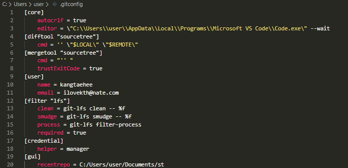

# add
```console
git add filename1 filename2
git folder/*

git add .
git add --all

git add --update
```

# commit
```console
git commit

git commit -m "message"
```
Staging Area 생략(git add)하고 commit
준비영역(stage)에 등록된 적이 있는 파일만 가능
```
git commit -a -m "message"
```
## comment 작성 
```
1번째 줄 : 커밋 내의 변경 내용을 요약 // git log --oneline 에 표시됨.
2번째 줄 : 빈 칸
3번째 줄 : 변경한 이유
```
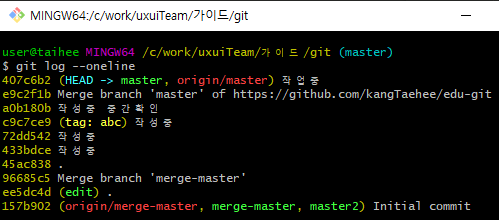

## 커밋 메시지 변경
새로운 커밋을 생성하지 않고(and) 가장 최근에 작성한 커밋 *코멘트 내용*을 수정
```
git commit --amend
git commit --amend -m "message"
```
☞ git commit과 같이 지정된 EDITOR를 실행하여 커밋 메시지 입력

## dash 하나와 두개의 차이

# log
```console
git log
git reflog

지정된 수만큼 로그를 출력
git log -3
git log -3 --oneline

한 줄로 메시지 보기
git log --oneline
git log --pretty=oneline

커밋의 diff 결과 보여 주기
git log -p
git log -p -2
히스토리 통계(수정된 파일, 얼마나 많은 파일이 변경, 얼마나 많은 라인)
git log --stat

로그 메시지와 하나의 커밋에 포함된 수정사항을 확인
git show 커밋해시
git show ba3784e
```

# tag
* 특정한 커밋을 찾아내기 위해 사용(책갈피), 버전관리
* 중복 비 허용


```console
태그 등록
git tag patch-12345

태그 정보 확인
git show pactch-12345

나중에 태그 하기
git tag <태그이름> <커밋해시>
git tag pactch-54321 abcdefg

모든 태그 목록 보기
git tag

태그가 적용된 커밋의 상세 정보 보기
git show <tag-name>
```
## tag를 다른 위치에 다시 사용해야 할때 
중복될 경우 다음과 같은 오류 문구가 나옵니다.
fatal: tag 'tip' already exists
이걸 무시하고 싶으시다면, 염력으로 이동 시키면 됩니다.
```console
git tag --force 태그
git tag -a 'abc' 45ac838 -f
```
## Annoatated Tag
tag에 대한 추가 정보 입력
```console
태그 등록
git tag -a <태그이름> -m "message"
git tag -a version-1.0 -m "version 1.0"

나중에 태그 하기
git tag -a <태그이름> <커밋해시> -m "message"
git tag -a version-0.1 a860054 -m "version 0.1"
```

## tag 공유
태그는 자동으로 리모트 서버에 전송하지 않는다.
별도로 서버에 PUSH해야 한다.
```console
태그를 원격 서버에 전송
git push origin [태그이름]
git push origin Version-1.0

모든 태그를 원격 서버에 전송
git push origin --tags
```

## tag 기반 체크 아웃
```
git checkout -b [브랜치이름] [태그이름]
git checkout -b release-1.0 version-1.0
```

# branch
* 브랜치는 저장소의 새로운 분할이다.
* 각각의 독립적인 작업을 동시에 진행 할 수 있다.


```
로컬 브랜치 목록 출력
git branch --list

모든 브랜치 목록
git branch --all
```


## 새로운 브랜치 생성 branch
```
git branch <branch-name>
git checkout <branch-name>

브랜치 생성
git branch release-1

브랜치 전환하기
git checkout release-1
```
## 새로운 브랜치 생성 하고 바로 체크 아웃 : branch 단계 생략
```
git checkout -b <branch-name>
git checkout -b hotfix-1
```

# stash
* 작업중인 브랜치에서 수정한 부분만 저장함.
* 스택(stack)형태로 저장됨 
* 수정했던 파일들을 복원할 때 반드시 stash했을 때와 같은 브랜치일 필요는 없다. 만약 다른 작업 중이던 브랜치에 이전의 작업들을 추가했을 때 충돌이 있으면 알려준다.

# 추가 개발중 운영서버 수정 요청이 들어 올때
* stage에 있는 수정된 파일이 있을때 checkout?

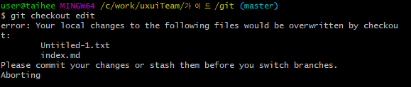

```
git stash list

현재 작업을 저장하고 브랜치를 HEAD로 이동(git reset --hard)
git stash save
```
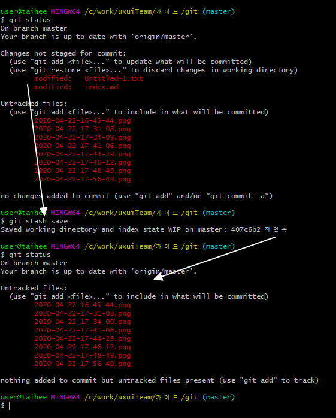

## *git reset --hard* 주의
* 변경내역을 지움 = 복구 불가?

## reflog
* head에 대한 변경이력 제공
```
git reflog
git reset --hard <커밋해시id 6자리>
git reset --hard HEAD@{번호}
```
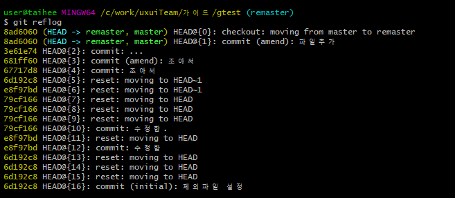

## 해당 head를 기준으로 삭제한 브렌치를 다시 만듬 = 삭제한 브렌치 복구
```
git checkout -b remaster 8ad6060
```
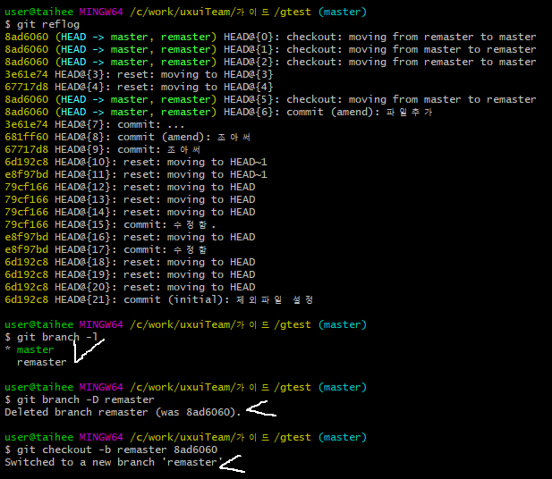

## Stash를 적용한 브랜치 만들기
수정한 파일에 Stash를 적용하면 충돌이 날 수 있다.
충돌이 나면 충돌을 해결해야 한다.
그리고 Stash한 것은 다시 테스트해야 한다.
git stash branch 명령을 실행하면 Stash할 당시의 커밋을
Checkout한 후 새로운 브랜치를 만들고 여기에 적용한다.
```
git stash branch newbranch
```

```
저장된 작업 꺼내기
git stash pop

git stash apply
가장 최근에 save한 stash가 현재 브랜치에 적용된다.
stash pop과 비슷하지만 list에서 삭제되지 않고 남아 있는다.
git stash apply stash@{0}

전체 리스트를 삭제
git stash clear
```
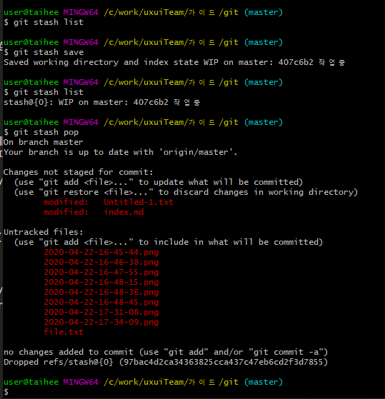

## stash 활용
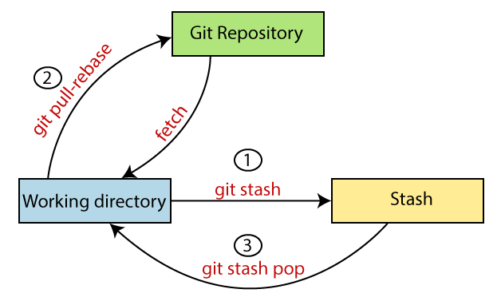


```
// 가장 최근의 stash를 제거한다.
$ git stash drop
// stash 이름(ex. stash@{2})에 해당하는 stash를 제거한다.
$ git stash drop [stash 이름]

// 가장 최근의 stash를 사용하여 패치를 만들고 그것을 거꾸로 적용한다.
$ git stash show -p | git apply -R
// stash 이름(ex. stash@{2})에 해당하는 stash를 이용하여 거꾸로 적용한다.
$ git stash show -p [stash 이름] | git apply -R
```
https://gmlwjd9405.github.io/2018/05/18/git-stash.html


# Merge
## Diff(비교)
```
변경 내용을 병합하기 전에 비교
git diff <원본브랜치> <대상브랜치>
git diff master hotfix
git diff master origin/master
```
## Merge(병합)
```
마스터(master)에 브랜치(hotfix)를 병합
git checkout master
git merge hotfix
로컬에 원격 브랜치 병합
git diff master origin/master
git merge origin/master
```

# Conflict 충돌
```
병합 취소
git merge --abort

출동 해결
충돌하는 파일을 수정 후 add, commit
git add <conflict-filename>
git commit -m "[merge] message"
```
* [과거의 버전으로 돌아가기 reset](https://opentutorials.org/course/2708/15210)
* [branch 병합 시 충돌해결](https://opentutorials.org/module/2676/15275)

# squash
* 여러개의 커밋을 묶기
* rebase 하기전이나 그래프 관리목적
* 새로운 해쉬를 가지며 push 하기전 사용을 권장 함.
```
최근 3개의 커밋을 interactive rebase 한다는 뜻입니다
$ git rebase -i HEAD~2
```

# rebase
## 목적
* 커밋 그래프를 단순하게 가져가고 의미 있는 커밋들로 관리하기 위해서입니다.


[rebase를 하지 않은 history]
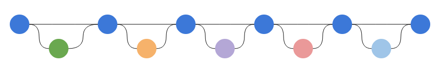
[rebase를 적용 한 history]

## 예제
1. upstream/feature-user 브랜치에서 작업 브랜치(bfm-100_login_layout)를 생성합니다.
    ```
    (feature-user)]gitfetchupstream(feature−user)] git checkout -b bfm-100_login_layout --track upstream/feature-user
    ```
1. 작업 브랜치에서 소스코드를 수정합니다. (뚝딱뚝딱 :hammer:)
1. 작업 브랜치에서 변경사항을 커밋합니다. (보통은 vi editor에서 커밋 메세지를 작성 함)
    ```
    (bfm-100_login_layout)]$ git commit -m “BFM-100 로그인 화면 레이아웃 생성”
    ```
2. 만약 커밋이 불필요하게 어려 개로 나뉘어져 있다면 squash를 합니다. (커밋 2개를 합쳐야 한다면)
    ```
    (bfm-100_login_layout)]$ git rebase -i HEAD~2
    ```
1. 작업 브랜치를 upstream/feature-user에 rebase합니다.
    ```
    (bfm-100_login_layout)]$ git pull --rebase upstream feature-user
    ```
1. 작업 브랜치를 origin에 push합니다.
    ```
    (bfm-100_login_layout)]$ git push origin bfm-100_login_layout
    ```
1. Github에서 bfm-100_login_layout 브랜치를 feature-user에 merge하는 Pull Request를 생성합니다.
    같은 feature를 개발하는 동료에게 리뷰 승인을 받은 후 자신의 Pull Request를 merge합니다. 
    만약 혼자 feature를 개발한다면 1~2명의 동료에게 리뷰 승인을 받은 후 Pull Request를 merge합니다.


# squash
* 여러개의 커밋을 묶기
* rebase 하기전이나 그래프 관리목적
* 새로운 해쉬를 가지며 push 하기전 사용을 권장 함.
```
최근 3개의 커밋을 interactive rebase 한다는 뜻입니다
$ git rebase -i HEAD~2
```

# rebase
## 목적
* 커밋 그래프를 단순하게 가져가고 의미 있는 커밋들로 관리하기 위해서입니다.


[rebase를 하지 않은 history]

[rebase를 적용 한 history]

## 예제
1. upstream/feature-user 브랜치에서 작업 브랜치(bfm-100_login_layout)를 생성합니다.
    ```
    (feature-user)]gitfetchupstream(feature−user)] git checkout -b bfm-100_login_layout --track upstream/feature-user
    ```
1. 작업 브랜치에서 소스코드를 수정합니다. (뚝딱뚝딱 :hammer:)
1. 작업 브랜치에서 변경사항을 커밋합니다. (보통은 vi editor에서 커밋 메세지를 작성 함)
    ```
    (bfm-100_login_layout)]$ git commit -m “BFM-100 로그인 화면 레이아웃 생성”
    ```
2. 만약 커밋이 불필요하게 어려 개로 나뉘어져 있다면 squash를 합니다. (커밋 2개를 합쳐야 한다면)
    ```
    (bfm-100_login_layout)]$ git rebase -i HEAD~2
    ```
1. 작업 브랜치를 upstream/feature-user에 rebase합니다.
    ```
    (bfm-100_login_layout)]$ git pull --rebase upstream feature-user
    ```
1. 작업 브랜치를 origin에 push합니다.
    ```
    (bfm-100_login_layout)]$ git push origin bfm-100_login_layout
    ```
1. Github에서 bfm-100_login_layout 브랜치를 feature-user에 merge하는 Pull Request를 생성합니다.
    같은 feature를 개발하는 동료에게 리뷰 승인을 받은 후 자신의 Pull Request를 merge합니다. 
    만약 혼자 feature를 개발한다면 1~2명의 동료에게 리뷰 승인을 받은 후 Pull Request를 merge합니다.

# 교육사이트
* https://backlog.com/git-tutorial/kr/intro/intro1_1.html
# squash
* 여러개의 커밋을 묶기
* rebase 하기전이나 그래프 관리목적
* 새로운 해쉬를 가지며 push 하기전 사용을 권장 함.
```
최근 3개의 커밋을 interactive rebase 한다는 뜻입니다
$ git rebase -i HEAD~2
```

# rebase
## 목적
* 커밋 그래프를 단순하게 가져가고 의미 있는 커밋들로 관리하기 위해서입니다.


[rebase를 하지 않은 history]

[rebase를 적용 한 history]

## 예제
1. upstream/feature-user 브랜치에서 작업 브랜치(bfm-100_login_layout)를 생성합니다.
    ```
    (feature-user)]gitfetchupstream(feature−user)] git checkout -b bfm-100_login_layout --track upstream/feature-user
    ```
1. 작업 브랜치에서 소스코드를 수정합니다. (뚝딱뚝딱 :hammer:)
1. 작업 브랜치에서 변경사항을 커밋합니다. (보통은 vi editor에서 커밋 메세지를 작성 함)
    ```
    (bfm-100_login_layout)]$ git commit -m “BFM-100 로그인 화면 레이아웃 생성”
    ```
2. 만약 커밋이 불필요하게 어려 개로 나뉘어져 있다면 squash를 합니다. (커밋 2개를 합쳐야 한다면)
    ```
    (bfm-100_login_layout)]$ git rebase -i HEAD~2
    ```
1. 작업 브랜치를 upstream/feature-user에 rebase합니다.
    ```
    (bfm-100_login_layout)]$ git pull --rebase upstream feature-user
    ```
1. 작업 브랜치를 origin에 push합니다.
    ```
    (bfm-100_login_layout)]$ git push origin bfm-100_login_layout
    ```
1. Github에서 bfm-100_login_layout 브랜치를 feature-user에 merge하는 Pull Request를 생성합니다.
    같은 feature를 개발하는 동료에게 리뷰 승인을 받은 후 자신의 Pull Request를 merge합니다. 
    만약 혼자 feature를 개발한다면 1~2명의 동료에게 리뷰 승인을 받은 후 Pull Request를 merge합니다.

# 교육사이트
* https://backlog.com/git-tutorial/kr/intro/intro1_1.html
# squash
* 여러개의 커밋을 묶기
* rebase 하기전이나 그래프 관리목적
* 새로운 해쉬를 가지며 push 하기전 사용을 권장 함.
```
최근 3개의 커밋을 interactive rebase 한다는 뜻입니다
$ git rebase -i HEAD~2
```

# rebase
## 목적
* 커밋 그래프를 단순하게 가져가고 의미 있는 커밋들로 관리하기 위해서입니다.


[rebase를 하지 않은 history]

[rebase를 적용 한 history]

## 예제
1. upstream/feature-user 브랜치에서 작업 브랜치(bfm-100_login_layout)를 생성합니다.
    ```
    (feature-user)]gitfetchupstream(feature−user)] git checkout -b bfm-100_login_layout --track upstream/feature-user
    ```
1. 작업 브랜치에서 소스코드를 수정합니다. (뚝딱뚝딱 :hammer:)
1. 작업 브랜치에서 변경사항을 커밋합니다. (보통은 vi editor에서 커밋 메세지를 작성 함)
    ```
    (bfm-100_login_layout)]$ git commit -m “BFM-100 로그인 화면 레이아웃 생성”
    ```
2. 만약 커밋이 불필요하게 어려 개로 나뉘어져 있다면 squash를 합니다. (커밋 2개를 합쳐야 한다면)
    ```
    (bfm-100_login_layout)]$ git rebase -i HEAD~2
    ```
1. 작업 브랜치를 upstream/feature-user에 rebase합니다.
    ```
    (bfm-100_login_layout)]$ git pull --rebase upstream feature-user
    ```
1. 작업 브랜치를 origin에 push합니다.
    ```
    (bfm-100_login_layout)]$ git push origin bfm-100_login_layout
    ```
1. Github에서 bfm-100_login_layout 브랜치를 feature-user에 merge하는 Pull Request를 생성합니다.
    같은 feature를 개발하는 동료에게 리뷰 승인을 받은 후 자신의 Pull Request를 merge합니다. 
    만약 혼자 feature를 개발한다면 1~2명의 동료에게 리뷰 승인을 받은 후 Pull Request를 merge합니다.

# 교육사이트
* https://backlog.com/git-tutorial/kr/intro/intro1_1.html
